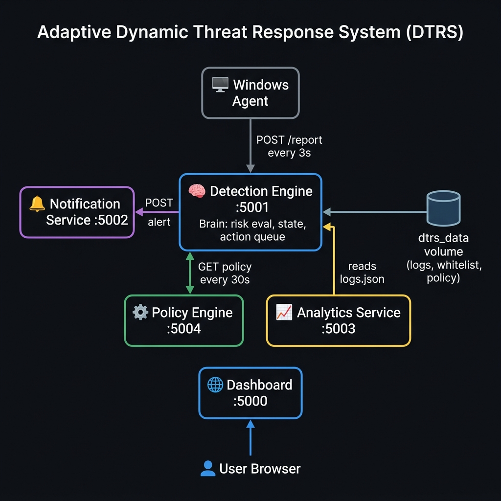
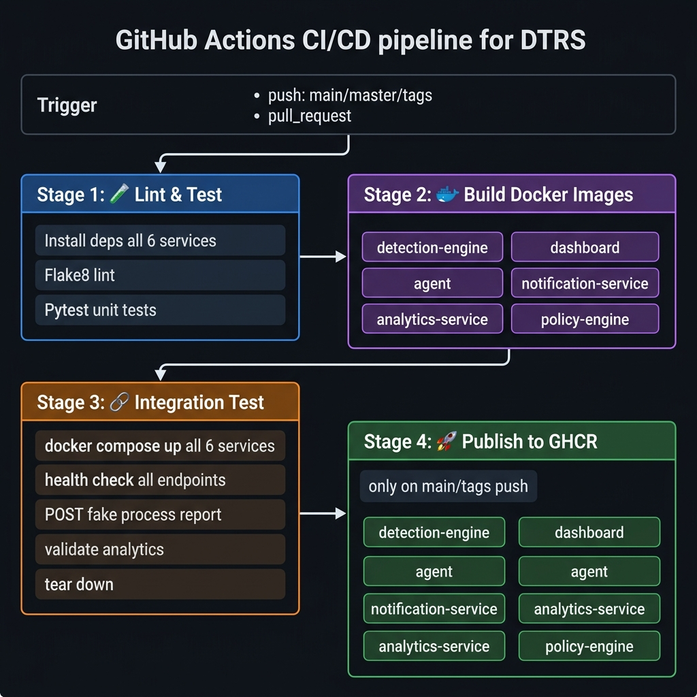
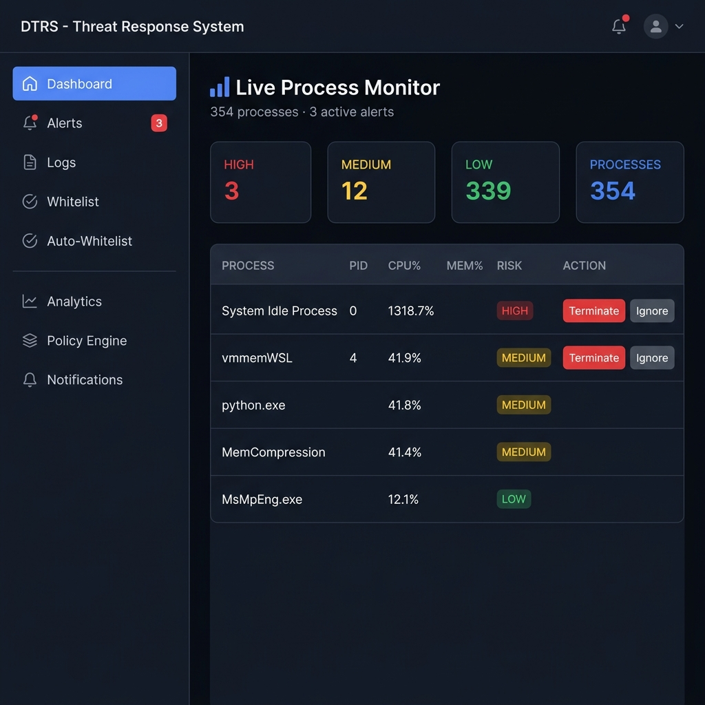
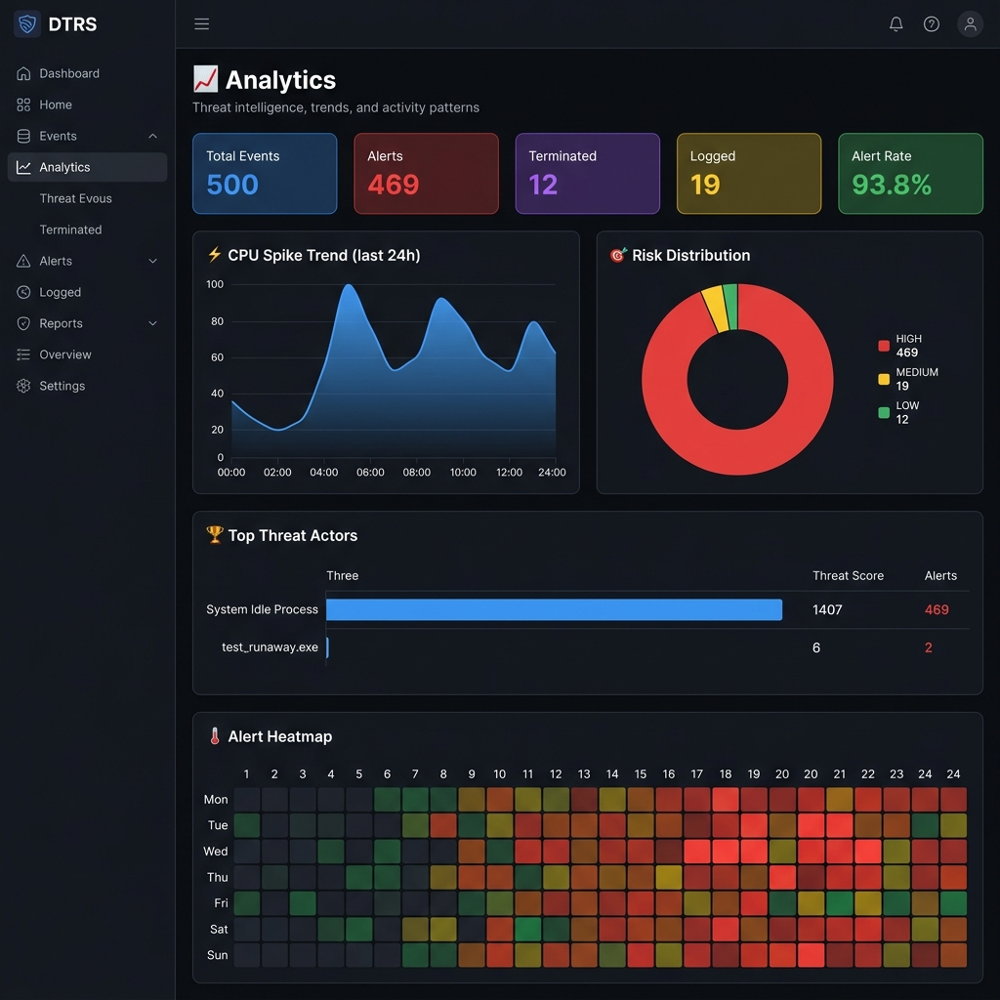
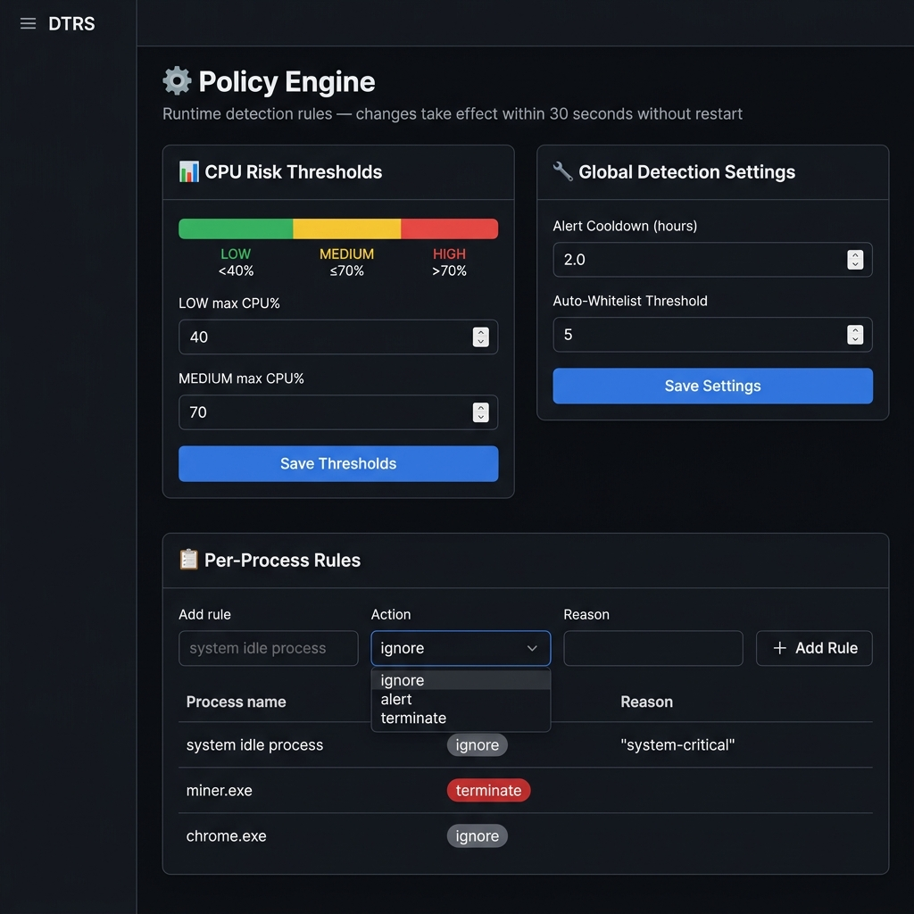
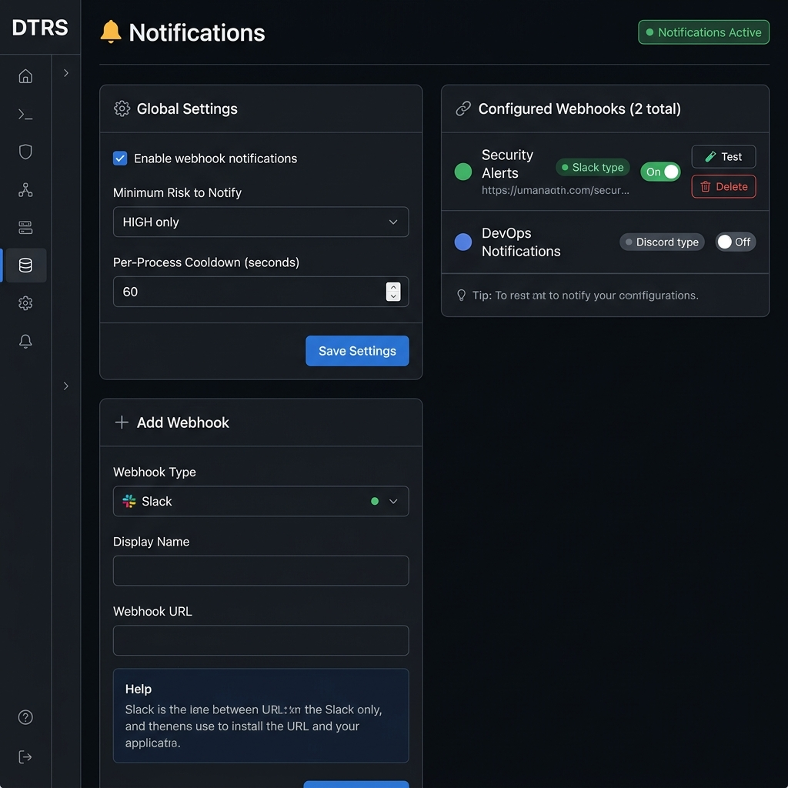

# Adaptive Dynamic Threat Response System (DTRS)
# Project Report — v2.0

**Module:** Cybersecurity / Systems Monitoring  
**Architecture:** Microservices (6 independent services)  
**Stack:** Python · Flask · Docker · Docker Compose · GitHub Actions  
**Repository:** [github.com/soraon123/ADAPTIVE_DYNAMIC_THREAT_RESPONSE](https://github.com/soraon123/ADAPTIVE_DYNAMIC_THREAT_RESPONSE)

---

## Table of Contents

1. [Project Overview](#1-project-overview)
2. [System Architecture](#2-system-architecture)
3. [Microservices](#3-microservices)
   - [3.1 Detection Engine](#31-detection-engine-port-5001)
   - [3.2 Web Dashboard](#32-web-dashboard-port-5000)
   - [3.3 Agent](#33-agent-native)
   - [3.4 Notification Service](#34-notification-service-port-5002)
   - [3.5 Analytics Service](#35-analytics-service-port-5003)
   - [3.6 Policy Engine](#36-policy-engine-port-5004)
4. [CI/CD Pipeline](#4-cicd-pipeline-github-actions)
5. [Docker & Containerisation](#5-docker--containerisation)
6. [Alert Cooldown Logic](#6-alert-cooldown-logic)
7. [Screenshots](#7-screenshots)
8. [API Reference](#8-api-reference)
9. [Environment Variables](#9-environment-variables)
10. [Running the System](#10-running-the-system)
11. [Troubleshooting & Recent Fixes](#11-troubleshooting--recent-fixes)

---

## 1. Project Overview

The **Adaptive Dynamic Threat Response System (DTRS)** is a real-time process monitoring and threat response platform built on a microservices architecture. It continuously scans running processes on a Windows/Linux host, classifies them by CPU-usage risk level, generates alerts for suspicious activity, and allows operators to respond via a web dashboard.

### Key Features

| Feature | Description |
|---|---|
| **Real-time monitoring** | Scans all running processes every 3 seconds using `psutil` |
| **Risk classification** | Classifies processes as LOW / MEDIUM / HIGH based on configurable CPU thresholds |
| **Alert management** | Tracks active HIGH-risk alerts; prevents duplicate alerts via cooldown |
| **Webhook notifications** | Sends formatted alerts to Slack, Discord, Teams, or any HTTP endpoint |
| **Threat analytics** | CPU trends, top offenders, heatmaps, risk distribution charts |
| **Runtime policy** | Change thresholds and rules without restarting any service |
| **Manual response** | Operators can terminate or ignore processes from the dashboard |
| **Whitelist system** | Manual whitelist + automatic whitelist for consistently safe processes |

---

## 2. System Architecture



The system is composed of **6 independent microservices** that communicate exclusively over HTTP. There is no shared in-process state between services — all coordination is done via REST API calls and a shared Docker volume (`dtrs_data`) for persistence.

### Communication Flow

```
Windows Host
    │
    │  psutil scans every 3s
    ▼
┌─────────────┐   POST /api/agent/report    ┌─────────────────────┐
│    Agent    │ ─────────────────────────▶  │  Detection Engine   │
│  (native)   │ ◀─── GET /api/agent/actions │       :5001         │
└─────────────┘                             │                     │
                                            │  ◀── GET /api/policy│
                                            │      every 30s      │
                                            │                     │
                                            │  POST /notify/alert ▶│
                                            └──────────┬──────────┘
                                                       │
                    ┌──────────────────────────────────┼──────────────────┐
                    │                                  │                  │
               ┌────▼────────┐              ┌──────────▼───┐   ┌─────────▼───┐
               │ Notification│              │   Analytics  │   │   Policy    │
               │  Svc :5002  │              │   Svc :5003  │   │  Engine     │
               │             │              │              │   │  :5004      │
               │ Slack/Discord│             │ Reads shared │   │ Thresholds  │
               │ Teams/Generic│             │ logs.json    │   │ Rules       │
               └─────────────┘              └──────────────┘   └─────────────┘
                                                       │
                                          ┌────────────▼──────────────┐
                                          │      Dashboard :5000       │
                                          │  Stateless — proxies all  │
                                          │  requests to services     │
                                          └────────────────────────────┘
                                                       ▲
                                                  👤 Browser
```

### Shared Volume

All stateful data is stored in the `dtrs_data` Docker volume and mapped to `/app/data` in each container that needs it:

| File | Owner | Readers |
|---|---|---|
| `logs.json` | Detection Engine | Analytics Service |
| `whitelist.txt` | Detection Engine | Detection Engine |
| `auto_whitelist.json` | Detection Engine | Detection Engine |
| `cooldowns.json` | Detection Engine | Detection Engine |
| `policy.json` | Policy Engine | Policy Engine |
| `notif_config.json` | Notification Service | Notification Service |

---

## 3. Microservices

### 3.1 Detection Engine (port 5001)

**Directory:** `detection_engine/`  
**Role:** The brain of DTRS — receives process snapshots, evaluates risk, manages alert state, queues actions for the Agent.

#### Files

| File | Purpose |
|---|---|
| `app.py` | Flask API server — agent-facing and dashboard-facing endpoints |
| `detection.py` | Risk classifier, whitelist logic, cooldown management, log I/O |
| `requirements.txt` | `flask`, `requests` |
| `Dockerfile` | Python 3.11-slim image |

#### Decision Pipeline (per process, per scan)

```
1. System-critical? (svchost, csrss, explorer…)  → IGNORE
2. Per-process policy rule from Policy Engine?    → apply rule action
3. In manual whitelist?                           → IGNORE
4. In auto-whitelist (≥N safe runs)?              → IGNORE
5. CPU < low_max (default 40%)?                   → LOW  → IGNORE
6. CPU ≤ medium_max (default 70%)?                → MEDIUM → LOG
7. In cooldown (2h after last alert/action)?      → IGNORE
8. CPU > medium_max                               → HIGH → ALERT + SET COOLDOWN
```

#### Key Endpoints

| Method | Path | Description |
|---|---|---|
| `POST` | `/api/agent/report` | Receive process snapshot from Agent |
| `GET` | `/api/agent/actions` | Agent polls for pending terminate commands |
| `POST` | `/api/agent/action-result` | Agent reports result of a termination |
| `GET` | `/api/internal/processes` | Dashboard: live process list |
| `GET` | `/api/internal/alerts` | Dashboard: active HIGH-risk alerts |
| `POST` | `/api/internal/queue-action` | Dashboard: queue terminate/ignore |
| `GET` | `/api/internal/logs` | Dashboard: event log |
| `GET` | `/health` | Health check |

---

### 3.2 Web Dashboard (port 5000)

**Directory:** `dashboard/`  
**Role:** Completely stateless Flask web UI. Holds no local state — every page proxies requests to the appropriate backend service.

#### Pages

| URL | Description |
|---|---|
| `/` | Live process table with risk badges and action buttons |
| `/alerts` | Active HIGH-risk alert list with terminate/ignore actions |
| `/logs` | Full event log (last 500 events) |
| `/whitelist` | Manual whitelist management |
| `/auto-whitelist` | Auto-whitelist entries and run counts |
| `/analytics` | Charts: trends, heatmap, top offenders, risk distribution |
| `/policy` | Runtime threshold and rule configuration |
| `/notifications` | Webhook configuration (Slack/Discord/Teams/Generic) |

#### Files

| File | Purpose |
|---|---|
| `app.py` | Flask routes — proxies to all 4 backend services |
| `templates/base.html` | Dark-theme base layout, sidebar, global alert overlay JS |
| `templates/home.html` | Live process table with auto-refresh |
| `templates/alerts.html` | Alert management |
| `templates/analytics.html` | Charts (SVG trend, donut, bars, heatmap) |
| `templates/policy.html` | Policy editor |
| `templates/notifications.html` | Webhook manager |

---

### 3.3 Agent (native)

**Directory:** `agent/`  
**Role:** Runs natively on the Windows machine to be monitored. Collects real process data, sends to Detection Engine, executes terminations.

> **Note:** The Agent must run **natively on Windows** (not inside Docker) to see host processes.  
> On Linux, `pid: host` in docker-compose can be used instead.

#### Main Loop (every 3 seconds)

```python
1. psutil.process_iter() → collect all running processes
2. POST /api/agent/report → send snapshot, receive new_alerts
3. Fire Windows toast notifications for new_alerts (winotify)
4. GET /api/agent/actions → receive pending terminate commands
5. psutil.Process(pid).terminate() → execute each command
6. POST /api/agent/action-result → report success/failure
```

#### Running the Agent

```powershell
cd agent
$env:DETECTION_ENGINE_URL = "http://localhost:5001"
$env:DASHBOARD_URL        = "http://localhost:5080"
& "C:\Program Files\Python311\python.exe" agent.py
```

---

### 3.4 Notification Service (port 5002)

**Directory:** `notification_service/`  
**Role:** Multi-channel webhook dispatcher. Called by the Detection Engine on every new HIGH-risk alert.

#### Supported Platforms

| Platform | Payload Format | Setup |
|---|---|---|
| **Slack** | Block Kit with attachment color | Incoming Webhook URL from api.slack.com |
| **Discord** | Rich Embed with color int | Channel → Integrations → Webhooks |
| **Microsoft Teams** | Adaptive Card (v1.4) | Connector → Incoming Webhook |
| **Generic HTTP** | Plain JSON `{source, event, alert, timestamp}` | Any HTTP endpoint |

#### Files

| File | Purpose |
|---|---|
| `notifier.py` | Webhook formatters (Slack/Discord/Teams/generic), cooldown, config I/O |
| `app.py` | Flask API — alert dispatch, webhook CRUD, test endpoint |

#### Key Endpoints

| Method | Path | Description |
|---|---|---|
| `POST` | `/api/notify/alert` | Dispatch alert to all enabled webhooks |
| `GET` | `/api/notify/config` | Get notification settings |
| `POST` | `/api/notify/config` | Update enabled, min_risk, cooldown |
| `GET` | `/api/notify/webhooks` | List configured webhooks |
| `POST` | `/api/notify/webhooks` | Add a webhook |
| `PATCH` | `/api/notify/webhooks/<id>` | Update a webhook (enable/disable, rename) |
| `DELETE` | `/api/notify/webhooks/<id>` | Delete a webhook |
| `POST` | `/api/notify/webhooks/<id>/test` | Send test alert |

#### Cooldown Logic

The Notification Service has its own per-process cooldown (default 60s) independent of the Detection Engine's 2-hour alert cooldown. This prevents webhook spam while still allowing the dashboard to show the alert.

---

### 3.5 Analytics Service (port 5003)

**Directory:** `analytics_service/`  
**Role:** Reads `logs.json` from the shared volume and computes aggregated threat intelligence.

#### Files

| File | Purpose |
|---|---|
| `analytics.py` | All aggregation functions (no external deps beyond stdlib) |
| `app.py` | Flask API exposing computed analytics |

#### Computed Metrics

| Metric | Description |
|---|---|
| **Summary** | Total events, alerts, terminations, alert rate, last event timestamp |
| **Top Processes** | Ranked by threat score = `alerts×3 + terminations×2` |
| **CPU Trends** | 30-minute bucketed avg/max CPU over last 24 hours |
| **Alert Heatmap** | 7×24 grid of alert counts by day-of-week × hour-of-day |
| **Risk Distribution** | Count of events per risk level (HIGH/MEDIUM/LOW) |

#### Key Endpoints

| Method | Path | Description |
|---|---|---|
| `GET` | `/api/analytics/summary` | Overall threat statistics |
| `GET` | `/api/analytics/top-processes?limit=N` | Top N threat actors |
| `GET` | `/api/analytics/trends?hours=24&bucket_minutes=30` | CPU time series |
| `GET` | `/api/analytics/heatmap` | 7×24 alert frequency grid |
| `GET` | `/api/analytics/risk-distribution` | HIGH/MEDIUM/LOW counts |

---

### 3.6 Policy Engine (port 5004)

**Directory:** `policy_engine/`  
**Role:** Single source of truth for detection rules. The Detection Engine polls this every 30 seconds — changes take effect without any service restart.

#### Files

| File | Purpose |
|---|---|
| `policy.py` | Thread-safe JSON rule storage and lookup |
| `app.py` | Flask CRUD API for thresholds, settings, and process rules |

#### Configurable Parameters

| Parameter | Default | Description |
|---|---|---|
| `low_max` | `40` | CPU% below which = LOW risk |
| `medium_max` | `70` | CPU% below which = MEDIUM risk (above = HIGH) |
| `cooldown_hours` | `2.0` | Hours before same process can alert again |
| `auto_whitelist_threshold` | `5` | Safe runs before auto-whitelisting |

#### Per-Process Rules

Each rule has: `name` (process name, case-insensitive), `action` (`ignore`/`alert`/`terminate`), `reason` (label).  
Rules override the normal risk classification pipeline.

#### Key Endpoints

| Method | Path | Description |
|---|---|---|
| `GET` | `/api/policy` | Full policy snapshot (Detection Engine polling endpoint) |
| `GET/POST` | `/api/policy/thresholds` | CPU threshold read/write |
| `GET/POST` | `/api/policy/settings` | Cooldown & auto-whitelist settings |
| `GET/POST` | `/api/policy/rules` | List / add process rules |
| `GET/DELETE` | `/api/policy/rules/<name>` | Get / delete a specific rule |

---

## 4. CI/CD Pipeline (GitHub Actions)



The pipeline defined in [`.github/workflows/ci-cd.yml`](../.github/workflows/ci-cd.yml) runs on every push to `main`/`master` and on all pull requests.

### Pipeline Stages

```
Push / PR
    │
    ▼
┌─────────────────────────────┐
│  Job 1: 🧪 Lint & Test      │  runs-on: ubuntu-latest
│  • Install all 6 service    │
│    dependencies             │
│  • Flake8 syntax check      │
│  • Flake8 style warnings    │
│  • pytest / unittest        │
└─────────────┬───────────────┘
              │ needs: lint-and-test
              ▼
┌─────────────────────────────┐
│  Job 2: 🐳 Build Images     │  matrix strategy (parallel)
│  6 parallel builds:         │
│  • detection-engine         │
│  • dashboard                │
│  • agent                    │
│  • notification-service     │
│  • analytics-service        │
│  • policy-engine            │
└─────────────┬───────────────┘
              │ needs: docker-build
              ▼
┌─────────────────────────────┐
│  Job 3: 🔗 Integration Test │
│  • docker compose up --build│
│  • Health check all 5 ports │
│  • POST fake process report │
│  • Validate analytics data  │
│  • Check dashboard pages    │
│  • docker compose down -v   │
└─────────────┬───────────────┘
              │ needs: integration-test
              │ only on push to main/tags
              ▼
┌─────────────────────────────┐
│  Job 4: 🚀 Publish to GHCR  │  matrix strategy (parallel)
│  6 parallel pushes to       │
│  ghcr.io/soraon123/dtrs-*   │
│  Tags: latest, branch, SHA, │
│  semver (on git tags)       │
└─────────────────────────────┘
```

### Docker Image Tags Published

| Tag | When |
|---|---|
| `latest` | Push to `main` or `master` |
| `main` / `master` | Push to that branch |
| `sha-<7chars>` | Every push |
| `1.2.3` | Git tag `v1.2.3` |
| `1.2` | Git tag `v1.2.3` |

### Published Images (GHCR)

```
ghcr.io/soraon123/dtrs-detection-engine:latest
ghcr.io/soraon123/dtrs-dashboard:latest
ghcr.io/soraon123/dtrs-agent:latest
ghcr.io/soraon123/dtrs-notification-service:latest
ghcr.io/soraon123/dtrs-analytics-service:latest
ghcr.io/soraon123/dtrs-policy-engine:latest
```

---

## 5. Docker & Containerisation

### docker-compose.yml Overview

```yaml
services:
  policy-engine          # starts first (detection-engine depends on it)
  notification-service   # starts early (detection-engine calls it)
  analytics-service      # reads shared volume
  detection-engine       # depends_on: policy-engine (healthy)
  dashboard              # depends_on: detection-engine (healthy)
  agent                  # depends_on: detection-engine (healthy)
                         # NOTE: runs in Docker but should run natively on Windows

volumes:
  dtrs_data:             # shared persistent volume for all JSON state files
```

### Port Map

| Service | Container Port | Host Port |
|---|---|---|
| Dashboard | 5000 | **5080** (5000 may be in use) |
| Detection Engine | 5001 | 5001 |
| Notification Service | 5002 | 5002 |
| Analytics Service | 5003 | 5003 |
| Policy Engine | 5004 | 5004 |

### Health Checks

All 5 HTTP services have Docker health checks:
```yaml
healthcheck:
  test: ["CMD", "python", "-c", "import urllib.request; urllib.request.urlopen('http://localhost:<PORT>/health')"]
  interval: 10s
  timeout: 5s
  retries: 3
```

Startup order is enforced via `depends_on: condition: service_healthy`.

---

## 6. Alert Cooldown Logic

### Problem
Without a cooldown, a process spiking above the HIGH threshold will generate an alert on **every 3-second scan** — filling the dashboard with duplicates and triggering repeated webhook notifications.

### Solution
A **two-tier cooldown** system:

```
Tier 1 — Alert-fire cooldown (Detection Engine)
  • Triggered: automatically when a process first generates an alert
  • Duration: configurable via Policy Engine (default 2 hours)
  • Effect: same process name won't alert again for 2 hours

Tier 2 — User-action cooldown (Detection Engine)
  • Triggered: when user clicks Ignore or Terminate on an alert
  • Duration: same cooldown_hours setting
  • Effect: resets/extends the 2-hour window

Tier 3 — Webhook notification cooldown (Notification Service)
  • Triggered: any webhook is sent for a process
  • Duration: configurable per Notification Service (default 60s)
  • Effect: prevents webhook spam while dashboard still shows alert
```

### Cooldown State Machine

```
Process HIGH risk
        │
        ├── is_in_cooldown? ──YES──▶ IGNORE (silent)
        │
        NO
        │
        ▼
  Fire ALERT
  record_action_cooldown()  ◀── cooldown starts NOW
        │
        ├── User: IGNORE   ──▶ remove from _alerts, record_action_cooldown() (resets)
        ├── User: TERMINATE ──▶ queue action, on success: record_action_cooldown() (resets)
        └── User: (closes overlay without action) ──▶ cooldown already set, no repeat
```

---

## 7. Screenshots

### Dashboard — Live Process Monitor



The main dashboard shows all running processes sorted by risk (HIGH first), with real-time stats and one-click terminate/ignore actions. A modal overlay pops up automatically when a new HIGH-risk process is detected.

---

### Analytics — Threat Intelligence



The analytics page aggregates historical log data into actionable threat intelligence:
- **Summary stats** — total events, alert count, termination count, alert rate
- **CPU Trend chart** — 30-minute bucketed SVG line chart over 24 hours
- **Risk Distribution** — interactive donut chart
- **Top Threat Actors** — ranked by threat score (alerts × 3 + terminations × 2)
- **Alert Heatmap** — 7×24 frequency grid showing when attacks peak

---

### Policy Engine — Runtime Configuration



The policy page lets operators change detection behaviour at runtime without restarting any service:
- **CPU Threshold editor** — visual colour bar showing LOW/MEDIUM/HIGH zones
- **Global settings** — alert cooldown duration, auto-whitelist threshold
- **Per-process rules** — pin any process to always ignore, always alert, or always terminate

---

### Notifications — Webhook Configuration



The notifications page manages multi-channel webhook delivery:
- **Global controls** — enable/disable all notifications, set minimum risk level, per-process cooldown
- **Webhook manager** — add Slack/Discord/Teams/Generic webhooks with contextual setup guides
- **Test button** — sends a sample HIGH-risk alert to verify connectivity

---

## 8. API Reference

### Detection Engine (:5001)

```
POST /api/agent/report              Agent scan upload
GET  /api/agent/actions             Agent action poll
POST /api/agent/action-result       Agent result report
GET  /api/internal/processes        Live process list
GET  /api/internal/alerts           Active alert list
GET  /api/internal/logs             Event log (last 500)
GET  /api/internal/whitelist        Whitelist + auto-whitelist
POST /api/internal/whitelist/add    Add to whitelist
POST /api/internal/whitelist/remove Remove from whitelist
GET  /api/internal/auto-whitelist   Auto-whitelist with threshold
POST /api/internal/queue-action     Queue terminate/ignore
GET  /health                        Health check
```

### Analytics Service (:5003)

```
GET /api/analytics/summary            Overall stats
GET /api/analytics/top-processes      Top N threat actors
GET /api/analytics/trends             CPU time-series buckets
GET /api/analytics/heatmap            7x24 alert frequency
GET /api/analytics/risk-distribution  HIGH/MEDIUM/LOW counts
GET /health                           Health check
```

### Policy Engine (:5004)

```
GET          /api/policy               Full policy snapshot
GET/POST     /api/policy/thresholds    CPU thresholds
GET/POST     /api/policy/settings      Cooldown, auto-WL settings
GET/POST     /api/policy/rules         List / add process rules
GET/DELETE   /api/policy/rules/<name>  Get / delete rule
GET          /health                   Health check
```

### Notification Service (:5002)

```
POST         /api/notify/alert              Dispatch alert
GET/POST     /api/notify/config             Settings
GET          /api/notify/webhooks           List webhooks
POST         /api/notify/webhooks           Add webhook
PATCH        /api/notify/webhooks/<id>      Update webhook
DELETE       /api/notify/webhooks/<id>      Delete webhook
POST         /api/notify/webhooks/<id>/test Send test alert
GET          /health                        Health check
```

---

## 9. Environment Variables

| Service | Variable | Default | Description |
|---|---|---|---|
| Detection Engine | `PORT` | `5001` | Listening port |
| Detection Engine | `DATA_DIR` | `.` | JSON storage directory |
| Detection Engine | `POLICY_ENGINE_URL` | `http://localhost:5004` | Policy Engine URL |
| Detection Engine | `NOTIFICATION_SERVICE_URL` | `http://localhost:5002` | Notification Service URL |
| Dashboard | `PORT` | `5000` | Listening port |
| Dashboard | `DETECTION_ENGINE_URL` | `http://localhost:5001` | — |
| Dashboard | `ANALYTICS_SERVICE_URL` | `http://localhost:5003` | — |
| Dashboard | `POLICY_ENGINE_URL` | `http://localhost:5004` | — |
| Dashboard | `NOTIFICATION_SERVICE_URL` | `http://localhost:5002` | — |
| Dashboard | `FLASK_SECRET` | `dtrs-dashboard-secret-2025` | Session secret |
| Agent | `DETECTION_ENGINE_URL` | `http://localhost:5001` | — |
| Agent | `DASHBOARD_URL` | `http://localhost:5000` | Toast notification link |
| Agent | `SCAN_INTERVAL` | `3` | Seconds between scans |
| Agent | `ACTION_INTERVAL` | `2` | Seconds between action polls |
| Notification Service | `PORT` | `5002` | Listening port |
| Notification Service | `DATA_DIR` | `.` | Config storage |
| Analytics Service | `PORT` | `5003` | Listening port |
| Analytics Service | `DATA_DIR` | `.` | Must match Detection Engine |
| Policy Engine | `PORT` | `5004` | Listening port |
| Policy Engine | `DATA_DIR` | `.` | Policy storage |

---

## 10. Running the System

### Option A — Docker Compose (recommended)

```bash
# Clone the repository
git clone https://github.com/soraon123/ADAPTIVE_DYNAMIC_THREAT_RESPONSE.git
cd ADAPTIVE_DYNAMIC_THREAT_RESPONSE

# Start all 6 services
docker-compose up --build

# Dashboard available at:
# http://localhost:5080
```

Then run the Agent natively on Windows (in a separate terminal):
```powershell
cd agent
pip install requests psutil
$env:DETECTION_ENGINE_URL = "http://localhost:5001"
$env:DASHBOARD_URL        = "http://localhost:5080"
python agent.py
```

### Option B — Run Services Locally

```powershell
# Terminal 1 — Policy Engine (start first)
cd policy_engine; pip install -r requirements.txt
python app.py   # :5004

# Terminal 2 — Detection Engine
cd detection_engine; pip install -r requirements.txt
$env:POLICY_ENGINE_URL = "http://localhost:5004"
python app.py   # :5001

# Terminal 3 — Notification Service
cd notification_service; pip install -r requirements.txt
python app.py   # :5002

# Terminal 4 — Analytics Service
cd analytics_service; pip install -r requirements.txt
python app.py   # :5003

# Terminal 5 — Dashboard
cd dashboard; pip install -r requirements.txt
$env:DETECTION_ENGINE_URL    = "http://localhost:5001"
$env:ANALYTICS_SERVICE_URL   = "http://localhost:5003"
$env:POLICY_ENGINE_URL       = "http://localhost:5004"
$env:NOTIFICATION_SERVICE_URL= "http://localhost:5002"
python app.py   # :5000

# Terminal 6 — Agent
cd agent; pip install -r requirements.txt
python agent.py
```

---

## 11. Troubleshooting & Recent Fixes

### Port 5000 Conflict
If the Dashboard fails to start with a "port is already allocated" error, this means port `5000` is already in use by another process on your host. 
**Fix applied:** The `docker-compose.yml` is configured to map the Dashboard to `http://localhost:5080` by default to avoid common conflicts.

### Empty Analytics / Not Seeing Windows Processes
If the Dashboard only shows ~25 processes (like `dockerd`, `init`, `containerd`) and Analytics is empty, the Docker Agent is only seeing Linux container processes.
**Fix applied:** Docker's `pid: host` capability is Linux-only. On Windows, you **must** run the Agent natively via PowerShell to monitor actual host processes.

### Continuous Alert Loops
If a process fluctuates around the HIGH-risk threshold and repeatedly triggers alerts without user interaction.
**Fix applied (Tier 1 Cooldown):** The Detection Engine now automatically sets the cooldown the exact moment a HIGH-risk alert fires. The same process will not re-alert for the configured cooldown period (default 2 hours) even if the user ignores the popup.

---

*Report generated: 2026-05-30 | DTRS v2.0 | 6 Microservices*
